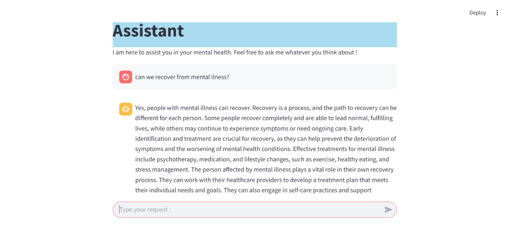

# **MentalBot - A Chatbot for Mental Health**

## **Context**

The development of **mental health-focused chatbots** represents a valuable advancement in making information more accessible and breaking down barriers around this sensitive topic. This project is based on a **carefully structured dataset** in Q&A format, covering a variety of themes such as anxiety, depression, and mental health awareness.

Leveraging the **Retrieval-Augmented Generation (RAG)** approach, the chatbot combines the retrieval of relevant information with personalized response generation using advanced **Natural Language Processing (NLP)** techniques. The goal? To create a **supportive and accessible dialogue space** to inform, raise awareness, and guide users.

---

## **Project Pipeline**

### **1. Data Collection**

The chatbot's knowledge base is built from a **Frequently Asked Questions (FAQ) dedicated to mental health**. This FAQ compiles commonly asked questions from the public, with clear and accessible answers to demystify mental health issues.

### **2. Data Preprocessing**

The questions and answers have been grouped into a corpus ready to be transformed into numerical vectors in the next step.

### **3. Embedding Generation**

To enable the chatbot to understand and search for relevant information effectively, the question-answer pairs were converted into **numerical representations** (also called **embeddings**). This transformation places phrases in a vector space where similar phrases are located closer to each other.

Several embedding models were tested for optimization:

* **MiniLM**: a lightweight and fast model, ideal for resource-limited environments.
* **mpnet**: captures complex semantic relationships, enhancing embeddings.
* **all-mpnet-base-v2**: excellent for semantic similarity tasks and search.

### **4. Indexing with FAISS**

To quickly retrieve the most relevant answers, the embeddings were indexed using **FAISS** (Facebook AI Similarity Search), a library optimized for similarity searches in high-dimensional vector sets.

### **5. Response Generation**

The most relevant documents are then passed through a **Hugging Face generative model** to produce smoother, more natural responses. This step adds a layer of personalization by adjusting the tone and content of the answers.

### **6. User Interface with Streamlit**

User interaction with the chatbot is via a **Streamlit** interface, providing a simple and intuitive experience. Users can ask questions freely and receive clear, precise responses within seconds. Below is a preview of our Streamlit interface:

---

### **Installation**

1. Install dependencies with `pip install -r requirements.txt`
2. Create a `.env` file with your Hugging Face API key by adding: `HUGGINGFACEHUB_API_TOKEN=your_api_key`
3. Launch the Streamlit interface with `streamlit run app_mental.py`

---

### **Main Features**

* **Optimized searches** using FAISS to find the most relevant answers.
* **Fluid responses** thanks to Hugging Face's generative model.
* **Intuitive interface** with Streamlit for a simplified user experience.
* **Personalized responses** based on user needs.

---

### **Future Improvements**

* Integration of new models to improve response accuracy.
* Addition of query tracking and analytics features to better understand user needs.
* Expansion of the knowledge base with input from mental health experts.

---

## **Authors**

BOUSSATTINE Fatine - ABOULAZM Hind - DJEDIS Kenza

---

Ready to dive into the fascinating world of NLP and make a difference in mental health? Launch **MentalBot** and start the journey! ✨
